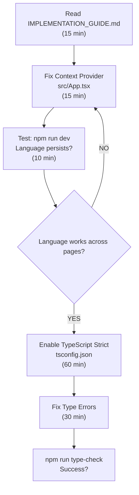
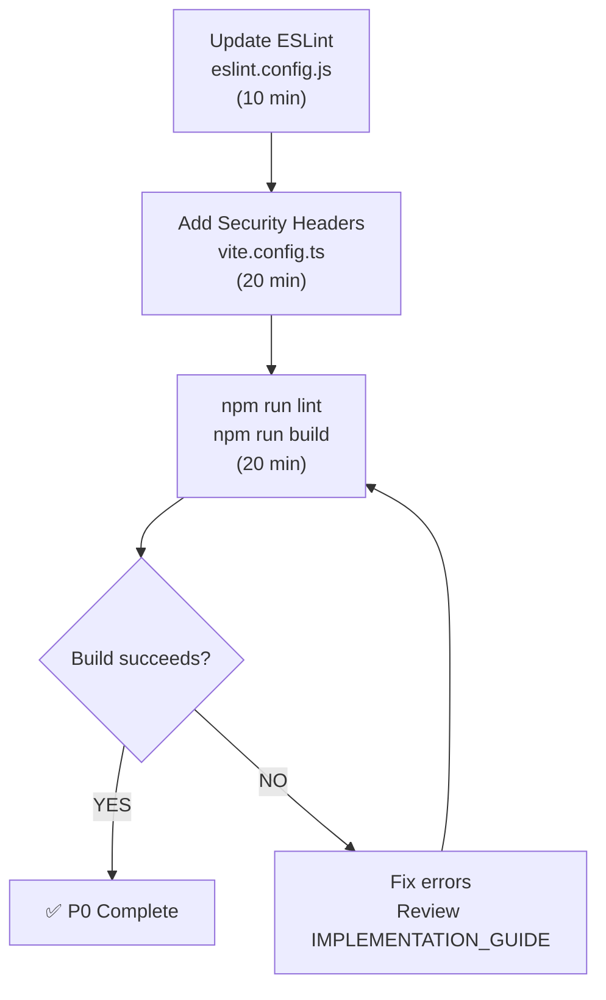
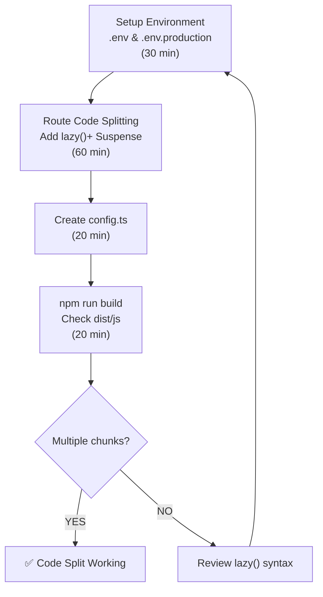
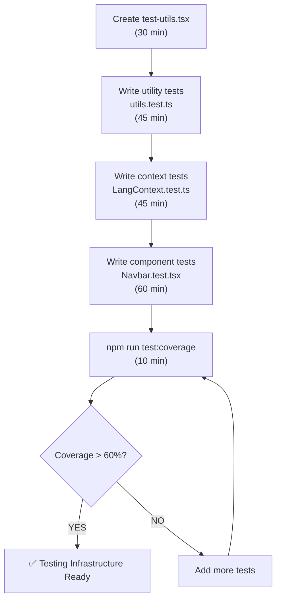
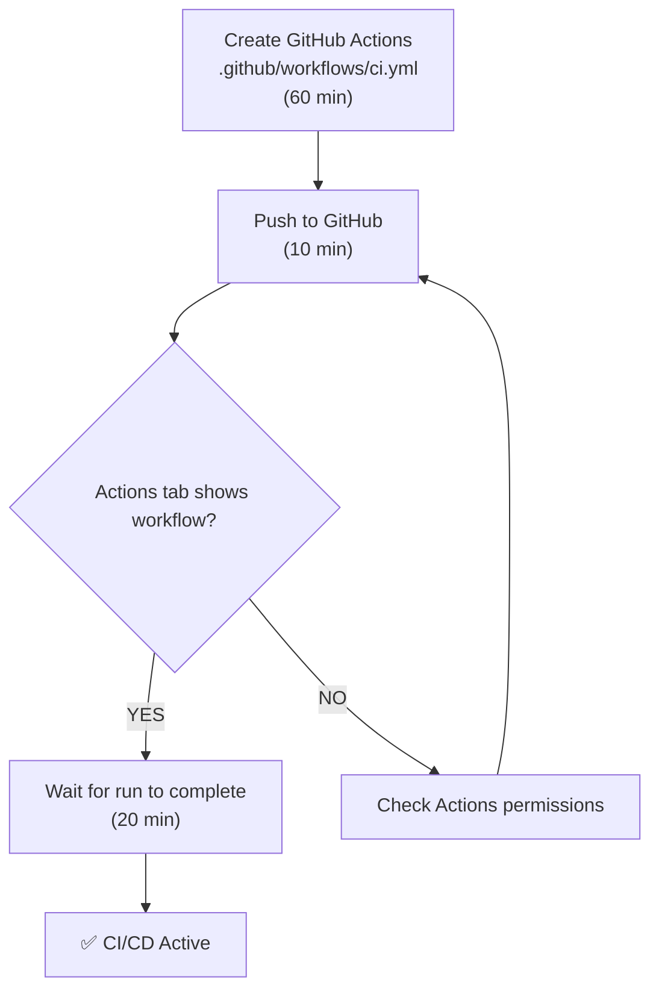
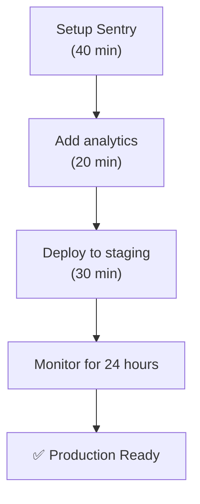

# 2026 READINESS: ACTION PLAN

## 📌 EXECUTIVE SUMMARY

Your portfolio site is **functional but unsafe for production**. With ~8 hours of focused work over 2-3 weeks, you can make it 2026-ready with proper security, testing, and scalability.

**Current State**: 4.5/10 (F)
**Target State**: 7.5/10 (C+)
**Timeline**: 2-3 weeks
**Effort**: ~8-10 hours

---

## 🗓️ PHASE 1: CRITICAL SECURITY (Week 1)

### Day 1: Context & TypeScript
**Duration**: 2.5 hours



**Commits**:
```bash
git add src/App.tsx src/pages/Index.tsx
git commit -m "fix: move LangProvider to app root"

git add tsconfig.json  
git commit -m "chore: enable TypeScript strict mode"
```

**Verification**:
```bash
npm run type-check     # ✅ 0 errors
npm run dev            # ✅ App starts
# Test language switching on /design page
```

---

### Day 2-3: Security & ESLint
**Duration**: 1 hour



**Commits**:
```bash
git add eslint.config.js
git commit -m "chore: enforce ESLint strict rules"

git add vite.config.ts
git commit -m "security: add security headers"
```

**Verification**:
```bash
npm run lint           # ✅ 0 errors
npm run build          # ✅ Clean build
npm run preview        # Check Network tab for headers
```

**Result**: All P0 issues fixed, 2 hours work ✅

---

## 📈 PHASE 2: STABILITY (Week 2-3)

### Sprint A: Code Organization (3 hours)



**Steps**:

1. **Create .env**:
```env
VITE_API_URL=http://localhost:3000
VITE_APP_ENV=development
```

2. **Update App.tsx** (add to imports):
```tsx
import { lazy, Suspense } from "react";

const DesignPage = lazy(() => import("./pages/DesignPage.tsx"));
const AcademyPage = lazy(() => import("./pages/AcademyPage.tsx"));
// ... etc
```

3. **Wrap routes** in Suspense

**Verify**:
```bash
npm run build
# Check dist/assets/ - should have multiple .js files
ls -lh dist/assets/*.js | wc -l  # Should be > 3
```

---

### Sprint B: Testing Foundation (4 hours)



**Key Test Files** (use templates from PERFORMANCE_TESTING_GUIDE.md):
- `src/test/test-utils.tsx` - Render wrapper
- `src/lib/__tests__/utils.test.ts` - Utility tests
- `src/context/__tests__/LangContext.test.tsx` - Context tests
- `src/components/__tests__/Navbar.test.tsx` - Component tests

**Commits**:
```bash
git add src/test src/**/__tests__
git commit -m "test: add test utilities and fixtures"

git add package.json
git commit -m "test: expand vitest configuration"
```

---

### Sprint C: Automation (2 hours)



**Copy template** from PERFORMANCE_TESTING_GUIDE.md

**Commits**:
```bash
git add .github/workflows/
git commit -m "ci: add GitHub Actions workflow"

git add .gitignore
# Add: dist/, coverage/, .env.local
git commit -m "chore: update gitignore"
```

**Result**: All P1 items done, automated validation running ✅

---

## 🚀 PHASE 3: OPTIMIZATION (Month 2)

### Sprint D: Performance Monitoring (3 hours)

```mermaid
graph TD
    A["Install rollup-visualizer<br/>(10 min)"] --> B["npm run build<br/>Open stats.html<br/>(20 min)"]
    B --> C["Identify large deps<br/>(15 min)"]
    C --> D{Framer Motion needed?}
    D -->|YES| E["Keep (57KB, good animation)")
    D -->|NO| F["Replace with CSS<br/>(Save 52KB)"]
    E --> G["Install sharp<br/>(10 min)"]
    F --> G
    G --> H["Setup image optimization<br/>(30 min)"]
    H --> I["npm run optimize-images"]
    I --> J["✅ Performance Baseline"]
```

---

### Sprint E: Monitoring & Analytics (2 hours)



---

## 📋 MASTER CHECKLIST

### Phase 1: Critical Security ✅ (Week 1, 2 hours)
- [ ] Context provider fixed
  - [ ] LangProvider moved to App.tsx
  - [ ] Language persists on navigation
- [ ] TypeScript strict enabled
  - [ ] All type errors fixed
  - [ ] `npm run type-check` passes
- [ ] ESLint rules enforced
  - [ ] `npm run lint` passes
- [ ] Security headers added
  - [ ] Headers visible in dev tools
  - [ ] CSP configured

**Target**: Zero errors in `npm run build`

---

### Phase 2: Stability (Week 2-3, 6 hours)
- [ ] Environment configuration
  - [ ] .env files created
  - [ ] URLs configurable
- [ ] Route code splitting
  - [ ] lazy() imported
  - [ ] Suspense boundaries added
  - [ ] Separate chunks in dist/
- [ ] Testing infrastructure
  - [ ] Test utilities created
  - [ ] >60% coverage achieved
  - [ ] All tests pass
- [ ] CI/CD pipeline
  - [ ] GitHub Actions configured
  - [ ] Auto-runs on PR

**Target**: Automated validation on every commit

---

### Phase 3: Optimization (Month 2, 5 hours)
- [ ] Bundle analysis
  - [ ] Visualizer installed
  - [ ] Large deps identified
- [ ] Image optimization
  - [ ] WebP versions created
  - [ ] Originals optimized
- [ ] Error tracking
  - [ ] Sentry configured
  - [ ] Production errors monitored
- [ ] Performance baseline
  - [ ] Lighthouse scores taken
  - [ ] Metrics tracked

**Target**: <3s load time, 80+ Lighthouse score

---

## 💼 RESOURCE REQUIREMENTS

### Tools Needed
- [ ] Git (for commits)
- [ ] VS Code (already have)
- [ ] npm/cli (already have)
- [ ] GitHub account (for CI/CD)
- [ ] Sentry account (free tier ok)

### Time Availability
- **Phase 1**: 2 hours in 1 sprint (do this first)
- **Phase 2**: 6 hours over 2 weeks (1.5 hrs/week)
- **Phase 3**: 5 hours in 1 sprint (optimization)
- **Total**: ~13 hours over 4 weeks

---

## 📊 SUCCESS METRICS

### Before vs After

| Metric | Before | After | Target |
|--------|--------|-------|--------|
| TypeScript Errors | Many | 0 | 0 |
| ESLint Errors | Disabled | 0 | 0 |
| Build Time | ? | <30s | <30s |
| Test Coverage | ~2% | 60% | 70%+ |
| Bundle Size | ? | Optimized | <150KB |
| Security Headers | None | All | All |
| CI/CD | None | GitHub Actions | GitHub Actions |
| Load Time | Unknown | Measured | <3s |

---

## 🎓 LEARNING OUTCOMES

After completing this plan, you'll have learned:

1. ✅ **React Context** - Proper provider placement
2. ✅ **TypeScript** - Strict mode and type safety
3. ✅ **Security** - Headers and CSP
4. ✅ **Performance** - Code splitting and bundling
5. ✅ **Testing** - Vitest and React Testing Library
6. ✅ **DevOps** - GitHub Actions CI/CD
7. ✅ **Monitoring** - Error tracking and analytics

These skills apply to **any** React project in 2026+

---

## 🎯 DECISION POINTS

### Decision 1: Start Now?
**Yes, immediately.** Phase 1 takes only 2 hours and fixes critical security.

### Decision 2: Keep Framer Motion?
- **Keep if**: You love the animations (57KB is acceptable)
- **Remove if**: You need minimal bundle size (CSS animations enough)

### Decision 3: Add API Backend?
- **Phase 1-2**: No, focus on frontend stability
- **Phase 3+**: Yes, add Node.js backend for contact form

### Decision 4: Database?
- **Now**: No needed, form emails work without it
- **Later**: Add if building admin panel

---

## 🚦 GO/NO-GO CRITERIA

### Go to Production When:
- ✅ All P0 items complete
- ✅ All P1 items complete  
- ✅ Zero TypeScript errors
- ✅ Zero ESLint errors
- ✅ 60%+ test coverage
- ✅ CI/CD pipeline passing
- ✅ Security headers present
- ✅ No console errors in production build

### Stay in Development When:
- ❌ TypeScript errors remain
- ❌ Test coverage <50%
- ❌ Security headers missing
- ❌ Context provider broken

---

## 📞 GETTING HELP

### If You Get Stuck

1. **Read the docs** (in order):
   - QUICK_REFERENCE.md (5 min)
   - IMPLEMENTATION_GUIDE.md (15 min)
   - PERFORMANCE_TESTING_GUIDE.md (20 min)

2. **Common Errors**:
   - TypeScript strict errors → Check IMPLEMENTATION_GUIDE.md Section 2
   - Test failures → Check PERFORMANCE_TESTING_GUIDE.md Testing section
   - ESLint warnings → Check IMPLEMENTATION_GUIDE.md Section 3

3. **Verify Setup**:
   ```bash
   npm run type-check
   npm run lint
   npm run test
   npm run build
   ```

---

## ✅ FINAL CHECKPOINT

When you complete this action plan, run:

```bash
# Should all pass ✅
npm run type-check      # 0 errors
npm run lint            # 0 errors
npm run test:coverage   # 60%+ coverage
npm run build           # Clean build
npm run dev             # App works locally
```

Then navigate to http://localhost:8080 and verify:
- ✅ Site loads
- ✅ Language switches work
- ✅ Language persists on navigation
- ✅ No console errors
- ✅ No TypeScript errors

**That's a 2026-ready portfolio site! 🎉**

---

## 📅 RECOMMENDED SCHEDULE

```
Week 1 (2 hrs)
  Mon: Read docs, setup
  Wed: Context + TypeScript fixes
  Fri: Security headers + ESLint

Week 2 (3 hrs)
  Mon: Environment config + code splitting
  Wed: Testing setup begins
  Fri: Test coverage growing

Week 3 (3 hrs)
  Mon: Complete test coverage (60%+)
  Wed: GitHub Actions
  Fri: All P1 complete, code review

Month 2 (5 hrs)
  Complete Phase 3 optimization
  Deploy to production
  Monitor metrics

DONE: Fully 2026-ready site! 🚀
```

---

**Let's make this happen!** Start with the QUICK_REFERENCE.md, then follow IMPLEMENTATION_GUIDE.md.

Good luck! 💪
